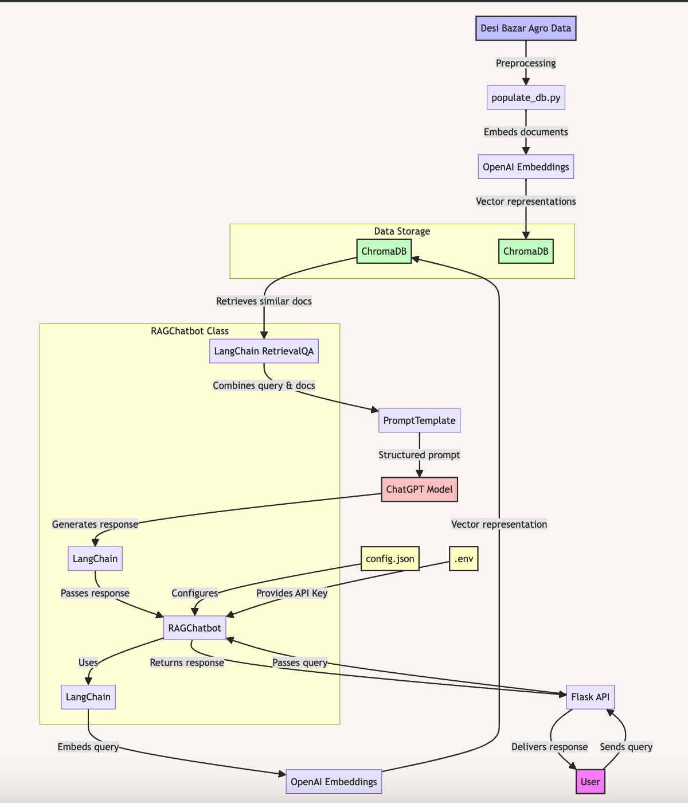

# GenAI + RAG: Business-Context-Aware Customer Assistant for Organic Farm-to-Table Business 

## Getting Started

This project aims to create a business context-aware customer assistant using Generative AI and Retrieval-Augmented Generation (RAG) techniques for Desi Bazar Agro. The assistant is built using Python, Flask, LangChain, ChromaDB, and OpenAI API.

### Prerequisites

- Python installed

### Cloning the Repository

Command to clone the repository:
```
git clone https://github.com/panktishah62/genai-tinkerlab.git 
cd genai-tinkerlab/RAG/GenAI-RAG-Context-Aware-Customer-Assistant-for-E-Commerce-Organic-Farm-to-Table-Store-main
```

### Setting up a Virtual Environment

- In the root directory run:
```
python -m venv venv
```
- Activate the virtual environment:
```
source venv/bin/activate
```
- For Windows:
```
venv\Scripts\activate
```
- Install the required dependencies:
```
pip install -r requirements.txt
```

### Running the Application

To run the application, make sure the virtual environment is active and run the following command:
```
python run.py
```

### Docker

The easiest way to run the application is by using Docker:
```
docker-compose up
```

### Process Flow



### Tech Stack

- **Python**: Main programming language
- **Flask**: Web framework for API
- **LangChain**: Framework for LLM applications
- **RetrievalQA**: Implements RAG pattern
- **PromptTemplate**: Structures prompts
- **ChromaDB**: Vector database for embeddings; embedded instance of DuckDB
- **OpenAI API**:
  - **ChatGPT model**: Generates responses
  - **Embeddings**: Creates vector representations
- **python-dotenv**: Manages environment variables
- **JSON**: For configuration and API responses

### RAG Process Flow

1. Text to embeddings (OpenAI)
2. Store in ChromaDB
3. Retrieve similar docs for query
4. LangChain combines docs + query
5. ChatGPT generates response
6. Flask serves response

### Frontend

- **HTML, CSS, and JavaScript**: (`index.html`, `style.css`, `chat.js`)

### Backend

- **Python with Flask**: (`backend_api.py`, `app.py`, `website.py`, `run.py`)
- **Configuration**: (`config.json`, `requirements.txt`)
- **Docker setup**: (`Dockerfile`, `docker-compose.yml`)
- **Additional utilities**: (`highlight.min.js`, `highlightjs-copy.min.js`, `icons.js`)

### Key Scripts

- **backend_api.py**: Loads environment variables and configuration, initializes the RAG chatbot, and sets up Flask routes.
- **rag_chatbot.py**: Initializes the ChromaDB client, sets up LangChain components, and provides methods for adding documents and querying.
- **populate_db.py**: Populates ChromaDB with initial data about Desi Bazar Agro.

### How to Run

1. Install dependencies:
   ```
   pip install -r requirements.txt
   ```
2. Populate the database:
   ```
   python populate_db.py
   ```
3. Run the backend API:
   ```
   python backend_api.py
   ```

### Docker Setup

1. Build and run the Docker containers:
   ```
   docker-compose up
   ```

### Health Check

Check the health of the application:
```
http://192.168.0.245:1338/health
```

### Additional Notes

- To clear and repopulate the database:
  ```
  python populate_db.py --clear
  ```
- To add/update without clearing:
  ```
  python populate_db.py
  ```
- `view_documents.py` is a diagnostic tool to verify the contents of the database.

### Issues and Improvements

- **Context Awareness**: Improve recognition of new conversation starters.
- **Response Templates**: Ensure the chatbot uses the exact response templates specified in the system prompt.
- **Product Information**: Ensure access to specific product information.
- **Limited Context**: Improve the context being used for responses.

### TODO

- Create a system prompt that includes:
  - Language guidelines
  - Customer interaction guidelines
  - Instructions for handling common inquiries (location, delivery fee, price list, general delivery)
  - Invoice creation process
- Implement language detection and response formatting in the chatbot's code.
- Store the following in your vector database:
  - Product information and pricing
  - Delivery charges and areas
  - Business overview and contact information
- Create functions or logic in your chatbot to handle:
  - Formatting and sending invoices
  - Sharing the WhatsApp catalog link
  - Detecting and appropriately responding to "hm" as "how much"


